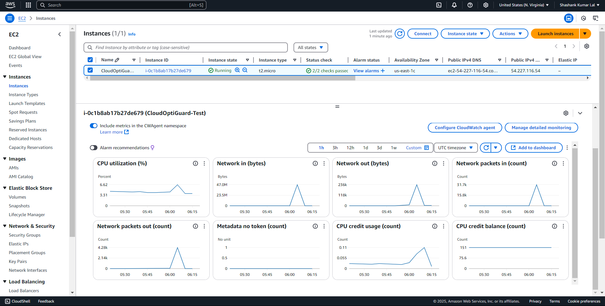

#AWS EC2 Monitoring & Cost Analysis

Project Overview
This mini-project demonstrates how to:
Launch and secure an EC2 instance on AWS.
Configure CloudWatch to monitor CPU, memory, and disk usage.
Set up Security Groups for controlled inbound/outbound traffic.
Track AWS Billing & Free Tier Usage to avoid unexpected costs.

.

##Technologies Used
Amazon EC2 (t2.micro) – Free tier instance for testing.
AWS CloudWatch – Monitoring CPU, memory, disk usage, network traffic.
AWS Billing & Cost Management – Tracking service costs and free tier usage.
IAM (Optional) – Managing permissions (creating an AdminUser for best practices).
Security Groups – Controlling inbound/outbound traffic to your instance.

##Why This Matters
Performance Visibility: CloudWatch metrics help you detect resource bottlenecks early.
Cost Awareness: Billing dashboard ensures you stay within free tier or catch rising costs quickly.
Security: Configuring security groups is essential for protecting cloud resources.
Practical AWS Experience: Hands-on with core AWS services for real-world cloud administration.

##How to Reproduce
Launch EC2 Instance: Use a t2.micro in a free tier-eligible region.
Configure Security Group: Allow SSH (port 22) and HTTP/HTTPS (ports 80/443) if needed.
Enable CloudWatch Monitoring: Either by default (basic) or install the CloudWatch Agent for custom metrics.
Check Billing Dashboard: Confirm usage is within free tier, analyze cost breakdown.
Create IAM User: Assign AdministratorAccess to avoid using root account daily.

##Next Steps
Add alarms in CloudWatch for CPU or billing thresholds.
Explore IAM Roles for better security practices.
Set up Cost Anomaly Detection for proactive cost alerts.
